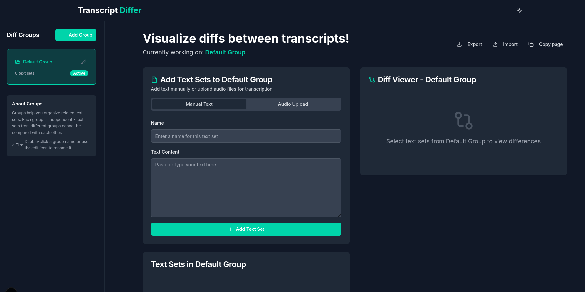

# transcript_diff

image of home page


# Setup

## Prepare environment
```sh
corepack enable   # enables pnpm that ships with Node 16+
corepack prepare pnpm@latest --activate

# or if you already use npm
npm i -g pnpm
```

## Install dependencies
```sh
pnpm install
```

## Run
```sh
pnpm dev
```